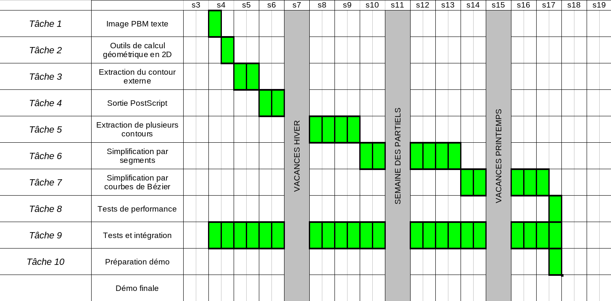

# MAP401

Ceci est notre projet logiciel de map401 "vectorisations et simplification d'image bitmap"  
Dans ce projet vous retrouverez des simplifications par contour, par courbes de bezier de degré 2 et de la génération d'images Postscript.

# Installation

`git clone https://github.com/JustAlternate/MAP401`

# Architecture du Projet

- divers : Les PDF de compte rendu des différentes taches et suivi de projet.  
- IMAGES_PERFORMANCE : L'ensemble des images de tests pour la tache 8.  
- IMAGES_TACHE3 : L'ensemble des images de la tache 3.  
- IMAGES_TACHE5 : L'ensemble des images de la tache 5.  
- IMAGES_TEST : L'ensemble de toutes les images pbm.  
- RESULTATS : Dossier dans lequel on met automatiquement toutes les images générées et résultats textuelle 
- scripts : des fichiers bash qui execute des programmes c de notre projet.
- src : L'ensemble de nos fichiers .c .h et executable ainsi que notre Makefile.

# Comment utiliser le projet

Pour générer tout les executables :  

1) placer vous dans le dossier src  
2) faites `make clear`  
3) puis `make`  

Maintenant que tous les executables ont été créer, vous pouvez maintenant executer soit à la main un par un tous les fichiers de tests (les fichiers executable qui commencent par test_\*)
Ou bien vous pouvez le faire automatique en faisant `make tests`  

`make tests` execute les fichiers suivants :

- ~~test_image~~ : test le paquetage de la tache1 (faite le a la main `./test_image`).  
- test_geometrie : test le paquetage de la tache2.  
- test_contour : test notre implémentation des contours en liste chainée.  
- test_EPS : test notre conversion dans le format EPS.  
- test_bezier : test notre implémentation des courbes de bezier. (fonctions "distance_point_bezier2", "approx_bezier2")  
- test_simplification_contour : test les fonctions "distance_point_segment", genere aussi les resultats de la tache6.  
- test_simplification_bezier2 : test les fonctions "simplification_bezier2" en generant les images resultats de la tache7.  

4) Aller dans le dossier RESULTATS pour regarder que tout a bien était générée correctement.  

Cette branche est actuellement à jour avec la branche tache8.  

Pour trouver une tache précisement changer de branche.  

Exemple : git switch tache3
pour acceder a la tache 3.

# Travail dans chaque tache

## Tache 1

**Complétion du paquetage image :**

Ecriture des fonctions  `ecrire_image` et `négatif_image`.  
Note : Pour la fonction négative(Image) nous avons décidé d'utiliser une formule arithmétique plutôt que d'utiliser un if pour savoir si le pixel est noir ou blanc et après le changer.

**Test du module image :**

Nous testons toutes les fonctions du module image même celles que nous n'avons pas implémenté nous-même. 
Le programme `test_image.c` lance 2 ou 3 tests sur TOUTES les fonctions du module image.
De plus ce programme teste les 2 fonctions `ecrire_image` et `negatif_image` sur toutes les images du dossier IMAGES_TEST

## Tache 2

**Paquetage geometrie 2D  :**

Pour le paquetage geometrie nous avons décidé d'enregistrer les types `Point` et `Vecteur` sous forme de struct et de ne pas utiliser de pointeurs dans les fonctions. Les pointeurs complexifieraient trop le code pour un bénéfice inexistant ou négligeable. Nous avons implémenté toutes les fonctions géométriques expliquées dans le cours.

**Commentaire :**

Nous tenons à faire remarquer que nous ne nous sommes pas servis de l'implémentation des vecteurs lors du reste du projet.  
A moins que l'exercice d'implémentation vous semble intéressant (elle ne diffère que très peu de l'implementation des points), je propose que l'implémentation des vecteurs ne soit plus requise l'année prochaine.

**Test du paquetage geometrie 2D :**

Pour le paquetage de test de geometrie nous avons testé tous les fonctions avec trois tests différents. Il y a aussi deux fonctions egale_point et egale_vecteur qui ne sont utilisés que pour les tests, donc seulement dans ce fichier. Les fonctions d'égalité sur les nombres flottans sont nulles, c'est une autre raison qui nous a poussés à ne pas mettre egale_point et egale_vecteur dans le paquetage geometrie.

## Tache 3

**Paquetage contour :**

Nous avons commencé par faire la fonction trouver_pixel_depart qui cherche un pixel pour commencer la recherche d'un contour. La fonction donnera toujours le même pixel (si jamais l'image est complètement blanche, elle retourne un point de coordonnée (0,0)).
Nous avons écrit la fonction recherche contour qui stocke les coordonnées des points qui forment un contour sous forme de liste chaînée.
Cette fonction fonctionne sous forme de petit automate qui est positionné au bord du contour et qui avance (avec la fonction avancer) et tourne (avec la fonction nouvelle_orientation) selon la procédure décrite dans le cours.
D'autres fonctions seront rajoutées plus tard.

**Paquetage sequence_point :**

La plupart des fonctions et types de ce paquetage sont issus de paquetage fourni : « exemple_sequence_point.c ». Certains noms ont étés modifiés et deux fonctions ont été écrites : print_line_Point et nombre_segments.
Nous avons décidé que nous n'implémenterions pas de tableaux et que ce paquetage serait donc fortement fournis.
Nous avons donc donné un deuxième nom à '`Liste_Point`' qui n'est autre que '`Contour`' car cela représent un contour dans notre code.
En plus des '`Contour`'/'`Liste_Point`', nous avons implémenté les '`Liste_Contour`' dont chaque cellule contient une '`Liste_Point`' aussi appelé '`Contour`'.
Les fonction de '`Liste_Contour`' sont les mêmes que pour '`Liste_Point`' (à part les fonctions de comptage tel nombre_segment...)

**Paquetage test_contour :**

Dans ce fichier nous avons fait 3 tests pour la fonction trouver_pixel_depart qui sont automatisés, puis aussi 3 tests pour la fonction recherche_contour, qui affichent à l'écran la liste des points pour les 3 images tests que nous avons spécialement conçues pour nos tests.

## Tache 4

**Paquetage EPS :**

Nous avons créer un fichier EPS.c qui permet d'écrire des fichier dans le format postscript. Pour cela nous avons réaliser une fonction '`init_fichier_eps`' qui permet de créer le fichier avec l'extension .eps puis de remplir l'entête du fichier ainsi que de nous renvoyer le pointeur vers le fichier ouvert.
La fonction dessinner ligne prend une ligne puis l'écrit dans le fichiers. Nous nous somme rendu compte plus tard que cette fonction ne pouvait pas bien être utilisé par la fonction qui écrit un contours en entier.
`'dessiner_contour`' prend un contour et l'écrit dans le fichier EPS ouvert. Cette fonction est utilisé par '`enregistrer_liste_contour_vers_EPS`' qui prend une liste de contour et l'écrit dans le fichier EPS (sans en tête ni bas de fichier).
Note : l'en-tête et le bas de fichier EPS sont les écrits qui ne se situent qu'en haut ou bas de fichier.

**Paquetage test_EPS :**

Pour ce paquetage nous avons procedés presque de la meme manière que pour les autre paquetage de test.
Pour les fonctions '`init_fichier_eps`' et '`ecrire_ligne`' nous avons réalisée des tests autonomes grâce a une super strategie qu'a trouver Isak pour verifier que les lignes dans le fichier sont correctes. Pour ce qui est de la fonction '`dessiner_contour`' nous n'avons pas eu la foi d'automatiser ce test et avons rajouter un message dans nos tests pour expliquer a l'utilisateur que ces tests sont a verifier soit meme.

## Tache 5


**Paquetage EPS :**

La fonction '`dessiner_contour`' n'écrit désormais plus dans le fichier eps 'showpage' et 'fill' car on veut pouvoir appeler cette fonction plusieurs fois.

**Paquetage contour :**

## Tache 6

**Paquetage geometrie :**

Nous avons fait le choix de retourner dans notre paquetage géometrie pour implémenter la fonction `distance_point_segment` qui selon nous merite d'être dans ce paquetage et qui nous permet de calculer la distance entre 2 points selon l'algorithme du poly de la tache 6.

**Paquetage simplification_contour :**

Dans celui çi nous avons implémenté la fonction `simplification_douglas_peucker` que nous avons remanié à notre sauce pour la faire fonctionner avec notre implémentation de liste chainée (car dans le poly, le pseudo code de cette fonction est pour une implémentation de tableau).
Les autres fonctions de ce paquetage sont des fonction d'enrobage qui nous facilite la vie pour les tests.

**Paquetage test_simplification_contour :**

Dans cette fonction de test, nous avons verifier 10 cas de figure pour notre fonction `distance_point_segment` (voir le code pour connaitre les cas testés).  
Nous avons automatisé la generation des simplification par contour des images : image_poly_tache6.pbm, elephant-gotlib.pbm, cheval.pbm, ...

## Tache 7

**Paquetage bezier :**

Ce paquetage represente simplement toute les fonctions qui sont utilisé pour manipuler des courbes de bezier.

**Paquetage test_bezier :**

Test les focntion distance_point_courbe_bezier2 avec l'exemple page 51 du poly ainsi que la fonction approx_bezier2 de la page 50 du poly.

**Paquetage sequence_bezier2 :**

Dans celui-çi on a réimplémenter toutes les structures de données de pour notre courbe de bézier.  
On a donc inventé les structure Motif et Dessin.  
Un Motif est une liste chainée contenant des cellules pointant vers des courbes de bézier2.  
Un Dessin est une liste chainée contenant des cellules pointant vers des Motif.  

**Paquetage simplification_bezier2 :**

Dans ce fichier, on a implémenter la fonction simplification_douglas_peucker_Bezier2 avec des liste chainée. Celle çi nous renvoie un Motif_Bezier2.

**Paquetage test_simplification_bezier2 :**

Ce genere les resultats pour la tache 7 partie 1.
(Elle test donc la fonction douglas_peucker avec d = 1, 3, 10 et 30)

**Paquetage faire_simplification_bezier2 :**

fichier pour generer des images EPS, prend en arguments un nom de fichier, un nom de sortie et une distance seuil, et applique donc la simplification par courbe de bezier2 sur cette image.

**Commentaire :**

Nous avons pris beaucoup de temps dans la réalisation de cette tache qui selon nous était la plus importante et la plus complexe.  
Dans cette tache nous avons du :  
- Créer les types : Bezier2, Motif_Bezier2, Dessin_Bezier2  
- Créer les fonctions de création et calculs sur les courbe de bézier 2  
- Faire des tests sur notre implémentation des courbe de bézier 2  
- Créer l'algorithme de simplification de courbe de bezier 2  
- Faire les tests sur l'implémentation de l'algo de simplification  
- Et enfin generer tout les résultats et images attendus pour le compte rendu de cette tache.  

Donc en somme beaucoup de boulot dans cette tache, surtout que noue étions arrivait a la phase où l'on se rend compte que notre projet est gros.  
On mettait a chaque debut de séance 20 minutes a se rappeler de ce que l'on était entrain de faire à la dernière séance.  

## Tache 8

**Paquetage test_performance :**

Dans ce paquetage nous avons créer une commande qui prend un nom de fichier, une distance seuil et la méthode pour simplifier. Et génère l'image EPS equivalente avec la simplification demandées. ainsi que les statistiques equivalente (nombre de contours et segments de l'image d'origine et nombre de segments de l'image simplifiée.)

**Paquetage génération_tache8_part2.sh :**

Qui prend les noms d'images qui sont dans le fichier fichiers_performance.txt et les simplifie automatique en segments et en bézier avec une distance seuil = [0, 0.5, 1, 2, 4, 8, 16]

Au final en comparant les différentes images générées on peut remarquer plusieur choses :

- Il semblerait que notre projet soit assez bien optimisée car notre plus grosse image test prend 8 secondes a simplifier.

- On remarque aussi que la simplification par courbe de bezier semble plus efficace que celle par segments. On a des images simplifiée plus proche de l'image réel, et avec moins d'éléments.

| Asterix                              | $d=1$                                      | $d=2$                                      | $d=4$                                      | $d=8$                                      |
|:------------------------------------:| ------------------------------------------ | ------------------------------------------ | ------------------------------------------ | ------------------------------------------ |
| Simplification par segments          |  |  |  |  |
| Simplification par courbe de bezier2 |  |  |  |  |

## Diagramme de GANT

